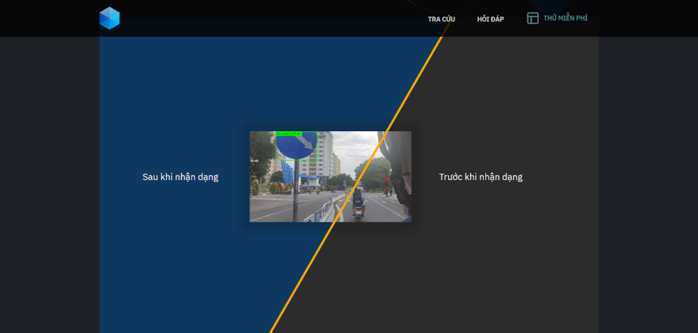
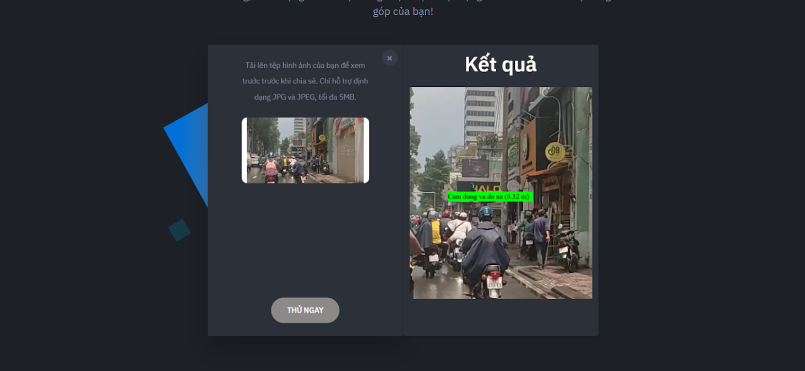

# Project: Traffic Sign Detection Web Application

## Demo Image

## Tech Stack

**Client:** HTML, SASS

**Server:** Flask

## Features

- Responsive Web Interface: Developed a dynamic and responsive user interface using HTML and Sass, ensuring compatibility across various devices and screen sizes.
- Image Upload: Enabled users to upload images containing traffic signs for detection.
- Traffic Sign Detection: Integrated YOLO (You Only Look Once) object detection model into the Flask backend to detect and classify traffic signs from uploaded images.
- Backend with Flask: Created a Flask API to handle image uploads, traffic sign detection, and manage user interactions.

